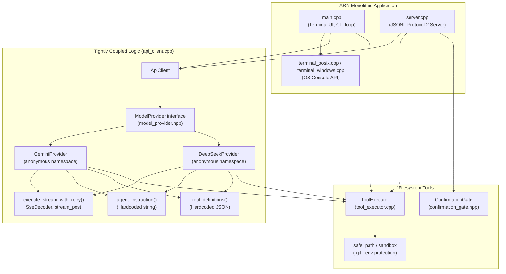
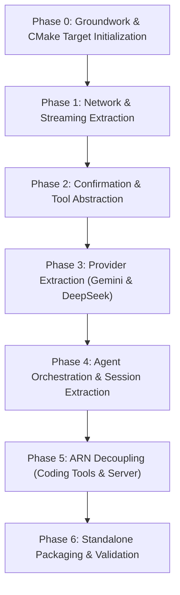

# ARN Core Refactor & Architecture Plan

## 1. Executive Summary & Vision

### 1.1 Goal
Transform **ARN** from a monolithic terminal AI coding agent into a two-tier system:
1. **ARN Core (`arn_core`)**: A reusable, modular, headless C++23 AI-agent library and framework providing LLM provider abstractions (Gemini, DeepSeek), networking/SSE streaming, conversation history management, tool definitions/registration, human-in-the-loop confirmation mechanisms, and multi-turn agent orchestration.
2. **ARN (`arn`)**: A specialized native coding agent application built on top of ARN Core, adding the terminal UI, coding assistant prompts, workspace filesystem tools with sandbox security, CLI commands, and the headless JSONL server (Protocol 2) used by the IDE bridge.

Future applications (such as **ARNday**, background daemons, or GUI tools) will be able to consume `arn_core` directly without any dependency on the terminal UI or coding-specific tools of `arn`.

### 1.2 Core Architectural Principles
- **Refactor, Not a Rewrite**: Preserve all existing functionality, protocols, and performance characteristics.
- **Continuous Buildability & Zero Regressions**: The codebase must build cleanly and pass all tests at the end of every individual phase.
- **Modern C++23**: Idiomatic use of `std::string_view`, `std::span`, `std::jthread`, `std::move`, `std::ranges`, and concepts where helpful.
- **Headless & UI-Agnostic**: ARN Core has zero knowledge of terminals, ANSI escape codes, or specific UI frameworks.
- **Extensible & Decoupled Tools**: Tools are registered dynamically via a tool registry; providers and orchestrators operate on abstract tool definitions rather than hardcoded filesystem tools.
- **Extensible Permissions**: Applications provide their own confirmation policies (CLI prompts, JSONL RPC events, GUI dialogs, or automated policies).
- **Zero Unnecessary Global State**: Eliminate static singletons or file-local static state in core components to allow multi-instance and multi-session concurrency.
- **Pragmatic First Version**: Do not over-engineer; ARN itself will serve as the primary validation testbed for the core framework.

---

## 2. Existing Codebase Analysis & Component Mapping

### 2.1 Current Directory & File Layout
```
├── CMakeLists.txt              # Root build script defining monolithic executable 'arn' & tests
├── include/
│   ├── api_client.hpp          # Session controller & provider multiplexer
│   ├── config_manager.hpp      # Empty placeholder for future config loading
│   ├── confirmation_gate.hpp   # Thread-safe CV synchronization for approval prompts
│   ├── model_list.hpp          # JSON parser for Gemini & DeepSeek catalog responses
│   ├── model_provider.hpp      # Abstract base class ModelProvider + provider enums
│   ├── server.hpp              # run_server() entrypoint for Protocol 2 headless server
│   ├── terminal.hpp            # Raw terminal abstraction, keyboard/mouse events, cancellation
│   └── tool_executor.hpp       # Hardcoded filesystem tools (list, read, write, replace, delete)
├── src/
│   ├── api_client.cpp          # HTTP/SSE logic, retry loop, Gemini & DeepSeek providers, tool loop
│   ├── config_manager.cpp      # Empty placeholder implementation
│   ├── main.cpp                # Terminal UI (ANSI renderer), CLI commands (/help, /model, etc.), main()
│   ├── server.cpp              # Protocol 2 JSONL stdin/stdout event loop for IDE bridge
│   ├── terminal_posix.cpp      # POSIX termios, poll(), escape sequence decoding
│   ├── terminal_windows.cpp    # Windows Console API, ReadConsoleInputW, GetAsyncKeyState cancellation
│   └── tool_executor.cpp       # Filesystem implementation with safe_path sandboxing
└── tests/
    ├── confirmation_test.cpp    # Unit tests for ConfirmationGate & ToolExecutor
    ├── model_list_test.cpp      # Unit tests for parse_model_list
    ├── model_provider_test.cpp  # Tests provider lookup and preferred model policies
    ├── server_fixture.cpp       # Mock provider fixture for protocol testing
    └── server_protocol_test.py  # Python integration test for JSONL Protocol 2
```

### 2.2 Component Dependency Mapping (Current Monolith)



### 2.3 Component Classification

| Component | Current Location | Classification | Migration Target | Notes |
| :--- | :--- | :--- | :--- | :--- |
| `SseDecoder` | `src/api_client.cpp` | **Generic** | `arn_core` (`net/sse_decoder.hpp`) | Pure SSE parsing, fully reusable across any streaming LLM |
| `execute_with_retry`, `retry_delay`, `stream_post` | `src/api_client.cpp` | **Generic** | `arn_core` (`net/http_client.hpp`) | Robust HTTP retry engine with exponential backoff & jitter |
| `parse_model_list` | `include/model_list.hpp` | **Generic** | `arn_core` (`providers/model_parser.hpp`) | Standard response parser for provider catalog endpoints |
| `ConfirmationGate` | `include/confirmation_gate.hpp` | **Generic** | `arn_core` (`confirmation/confirmation_gate.hpp`) | Thread synchronization primitive for asynchronous approvals |
| `ModelProvider` base class | `include/model_provider.hpp` | **Reusable (Coupled)** | `arn_core` (`provider/model_provider.hpp`) | Currently tightly coupled to `ToolExecutor`; needs decoupling |
| `GeminiProvider` | `src/api_client.cpp` | **Reusable (Coupled)** | `arn_core` (`providers/gemini_provider.hpp`) | Wire protocol & streaming logic is generic; needs decoupling from hardcoded tools |
| `DeepSeekProvider` | `src/api_client.cpp` | **Reusable (Coupled)** | `arn_core` (`providers/deepseek_provider.hpp`) | OpenAI-compatible wire protocol; needs decoupling from hardcoded tools |
| Tool Execution Loop (`max_tool_rounds = 12`) | `src/api_client.cpp` (duplicated) | **Generic / Framework** | `arn_core` (`agent/agent_session.cpp`) | Core multi-turn agent loop currently duplicated in both providers |
| `ToolExecutor` (Interface & Registry) | `include/tool_executor.hpp` | **Coupled Concept** | `arn_core` (`tool/tool.hpp`, `tool/tool_registry.hpp`) | Needs extraction into generic `ITool` and `ToolRegistry` |
| Filesystem Tools (`list_files`, `read_file`, `write_file`, etc.) | `src/tool_executor.cpp` | **ARN Specific** | `arn` (`tools/coding_tools.hpp`) | Specific to coding agent domain; registered as concrete `ITool` instances |
| Filesystem Sandbox (`safe_path`, `.git`, `.env` checks) | `src/tool_executor.cpp` | **ARN Specific** | `arn` (`tools/workspace_sandbox.hpp`) | ARN-specific security boundary for workspace operations |
| System Prompt (`agent_instruction()`) | `src/api_client.cpp` | **ARN Specific** | `arn` (`agent/coding_prompt.hpp`) | Coding assistant instructions passed into ARN Core session |
| Interactive Terminal UI (`Ui` class, ANSI drawing) | `src/main.cpp` | **ARN Specific** | `arn` (`ui/terminal_ui.hpp`, `main.cpp`) | Pure presentation layer |
| Terminal Console Driver | `src/terminal_*.cpp` | **ARN Specific (Platform)** | `arn` (`terminal/terminal_*.cpp`) | OS-specific terminal control (Windows API / POSIX termios) |
| Headless Server (Protocol 2) | `src/server.cpp` | **ARN Specific** | `arn` (`server/server.cpp`) | JSONL IPC bridge for Tauri IDE |
| `ConfigManager` | `include/config_manager.hpp` | **Placeholder** | Kept in `arn` / expanded later | Currently an empty stub |

---

## 3. ARN Core Target Architecture & Public API Design

### 3.1 Design Philosophy
- **Namespace**: All core types live under `arn::core`.
- **Headers**: Public headers are placed in `<arn/core/...>`.
- **Modular Subsystems**:
  - `arn::core::net`: HTTP transport, SSE decoding, retry backoff.
  - `arn::core::tools`: Tool definitions, invocations, results, and registry.
  - `arn::core::confirmation`: Extensible confirmation requests and approval handlers.
  - `arn::core::providers`: Provider interfaces and built-in implementations.
  - `arn::core::agent`: Multi-turn agent session, prompt-and-tool loop, streaming dispatch.

### 3.2 Target Architecture Diagram

```mermaid
flowchart TD
    subgraph Third_Party_Or_ARNday ["Future Consumer (e.g. ARNday)"]
        ARNdayApp["Custom App / GUI / Daemon"]
        ARNdayTools["Custom Tools<br/>(Calendar, DB, API...)"]
    end

    subgraph ARN_Application ["ARN Coding Agent Application"]
        ArnMain["CLI Main & Terminal UI"]
        ArnServer["Protocol 2 JSONL Server"]
        CodingTools["Coding Tools (read, write, list...)"]
        Sandbox["Workspace Sandbox (safe_path)"]
        CodingPrompt["ARN Coding Prompt"]
    end

    subgraph ARN_Core ["ARN Core (arn_core library)"]
        AgentSession["AgentSession<br/>(Conversation & Orchestration)"]
        ToolRegistry["ToolRegistry<br/>(Dynamic Tool Registration)"]
        IConfirmation["IConfirmationHandler<br/>& ConfirmationGate"]
        IProvider["IModelProvider"]
        
        subgraph Providers ["Provider Implementations"]
            Gemini["GeminiProvider"]
            DeepSeek["DeepSeekProvider"]
            CustomProv["Custom Providers..."]
        end

        subgraph Core_Net ["Networking Infrastructure"]
            HttpClient["HttpClient / stream_post"]
            SseDecoder["SseDecoder"]
            RetryPolicy["Retry & Backoff Engine"]
        end
    end

    ArnMain --> AgentSession
    ArnMain --> CodingTools
    ArnServer --> AgentSession
    ArnServer --> IConfirmation
    CodingTools --> Sandbox
    CodingTools --> ToolRegistry
    CodingPrompt --> AgentSession

    ARNdayApp --> AgentSession
    ARNdayTools --> ToolRegistry

    AgentSession --> ToolRegistry
    AgentSession --> IConfirmation
    AgentSession --> IProvider
    IProvider <|-- Gemini
    IProvider <|-- DeepSeek
    IProvider <|-- CustomProv
    Gemini --> Core_Net
    DeepSeek --> Core_Net
```

### 3.3 Proposed Public API Specifications

#### `types.hpp`
Common value types, callbacks, and cancellation abstraction.
```cpp
namespace arn::core {

enum class ProviderType {
    none,
    gemini,
    deepseek,
    custom
};

[[nodiscard]] std::string_view provider_type_name(ProviderType type) noexcept;
[[nodiscard]] ProviderType provider_type_from_name(std::string_view name) noexcept;

struct ApiResult {
    bool ok{false};
    std::string message;
    std::vector<std::string> models;
    bool cancelled{false};
};

using TextStreamCallback = std::function<void(std::string_view text_delta)>;
using ProgressCallback = std::function<void(std::string_view progress_message)>;

struct StreamCallbacks {
    TextStreamCallback on_text;
    ProgressCallback on_progress;
};

// Thread-safe cancellation token wrapper supporting std::atomic_bool or std::stop_token
class CancellationToken {
public:
    CancellationToken() = default;
    explicit CancellationToken(const std::atomic_bool* flag) : external_flag_(flag) {}

    [[nodiscard]] bool is_cancelled() const noexcept {
        return (external_flag_ && external_flag_->load(std::memory_order_relaxed)) ||
               local_flag_.load(std::memory_order_relaxed);
    }
    void cancel() noexcept { local_flag_.store(true, std::memory_order_relaxed); }
    void reset() noexcept { local_flag_.store(false, std::memory_order_relaxed); }

private:
    const std::atomic_bool* external_flag_{nullptr};
    std::atomic_bool local_flag_{false};
};

} // namespace arn::core
```

#### `tool.hpp` & `tool_registry.hpp`
Extensible tool system allowing any application to register custom tools.
```cpp
namespace arn::core {

struct ToolDefinition {
    std::string name;
    std::string description;
    nlohmann::json parameter_schema; // Standard JSON schema (portable across providers)
};

struct ToolContext {
    const CancellationToken* cancellation{nullptr};
};

struct ToolResult {
    bool ok{false};
    nlohmann::json output;
    std::string error_message;

    static ToolResult success(nlohmann::json result_data) {
        return {true, std::move(result_data), {}};
    }
    static ToolResult failure(std::string message) {
        return {false, {{"error", message}}, std::move(message)};
    }
};

class ITool {
public:
    virtual ~ITool() = default;
    [[nodiscard]] virtual const ToolDefinition& definition() const noexcept = 0;
    [[nodiscard]] virtual bool requires_confirmation() const noexcept { return false; }
    [[nodiscard]] virtual ToolResult execute(const nlohmann::json& arguments,
                                             const ToolContext& context) = 0;
};

class ToolRegistry {
public:
    ToolRegistry() = default;

    void register_tool(std::shared_ptr<ITool> tool);
    [[nodiscard]] std::shared_ptr<ITool> find_tool(std::string_view name) const;
    [[nodiscard]] std::vector<ToolDefinition> definitions() const;
    [[nodiscard]] bool empty() const noexcept;
    void clear();

private:
    std::map<std::string, std::shared_ptr<ITool>, std::less<>> tools_;
};

} // namespace arn::core
```

#### `confirmation.hpp`
Pluggable human-in-the-loop confirmation and thread-safe approval gating.
```cpp
namespace arn::core {

struct ConfirmationRequest {
    std::string tool_name;
    std::string summary;
    nlohmann::json arguments;
    nlohmann::json preview; // Application-specific preview (e.g., path, before/after diff)
};

class IConfirmationHandler {
public:
    virtual ~IConfirmationHandler() = default;
    [[nodiscard]] virtual bool confirm(const ConfirmationRequest& request) = 0;
};

using ConfirmationFn = std::function<bool(const ConfirmationRequest&)>;

// Reusable ConfirmationGate for cross-thread approval synchronization
class ConfirmationGate {
    std::mutex mutex_;
    std::condition_variable cv_;
    const std::string nonce_;
    unsigned long long sequence_{0};
    std::string pending_;
    bool answered_{false}, approved_{false}, cancelled_{false};

public:
    ConfirmationGate();
    void reset();
    void cancel();
    bool answer(const std::string& id, bool approved);

    template <class EmitFn>
    bool wait(EmitFn&& emit, std::chrono::milliseconds timeout = std::chrono::seconds(120)) {
        // Implementation preserved identically from existing confirmation_gate.hpp
    }
};

} // namespace arn::core
```

#### `provider.hpp`
Common LLM provider interface. Providers handle provider-specific wire formatting, authentication, and HTTP endpoints.
```cpp
namespace arn::core {

class IModelProvider {
public:
    virtual ~IModelProvider() = default;

    [[nodiscard]] virtual ProviderType type() const noexcept = 0;
    [[nodiscard]] virtual std::string_view name() const noexcept = 0;
    [[nodiscard]] virtual std::string
    preferred_model(const std::vector<std::string>& models) const = 0;

    [[nodiscard]] virtual ApiResult list_models(const std::string& api_key,
                                                const CancellationToken* cancel = nullptr) = 0;

    // Send prompt with tools and stream response
    [[nodiscard]] virtual ApiResult
    submit_prompt(const std::string& api_key, const std::string& model,
                  const std::string& system_instruction, const std::string& user_prompt,
                  const ToolRegistry& tools, const ConfirmationFn& confirm,
                  const StreamCallbacks& callbacks, const CancellationToken* cancel) = 0;

    virtual void cancel_active_request() = 0;
    virtual void reset_session() = 0;
    [[nodiscard]] virtual std::size_t session_entries() const noexcept = 0;
};

[[nodiscard]] std::unique_ptr<IModelProvider> create_provider(ProviderType type);

} // namespace arn::core
```

#### `agent.hpp`
Top-level agent session orchestrator managing conversation state, model selection, tool execution, and cancellation.
```cpp
namespace arn::core {

struct AgentConfig {
    std::string system_instruction;
    int max_tool_rounds{12};
    std::size_t max_history_entries{40};
};

class AgentSession {
public:
    explicit AgentSession(AgentConfig config = {});
    ~AgentSession();

    AgentSession(const AgentSession&) = delete;
    AgentSession& operator=(const AgentSession&) = delete;

    void set_system_instruction(std::string instruction);
    void set_tools(std::shared_ptr<ToolRegistry> tools);
    void set_confirmation_handler(ConfirmationFn confirm_handler);

    [[nodiscard]] ApiResult configure_provider(ProviderType type, const std::string& api_key,
                                               const CancellationToken* cancel = nullptr);

    [[nodiscard]] std::vector<std::string> available_models() const;
    [[nodiscard]] std::string preferred_model() const;
    void select_model(std::string model);

    [[nodiscard]] ApiResult prompt(std::string_view text,
                                   const StreamCallbacks& callbacks = {},
                                   const CancellationToken* cancel = nullptr);

    void cancel_active_request();
    void reset_session();
    [[nodiscard]] std::size_t session_entries() const noexcept;
    [[nodiscard]] ProviderType active_provider() const noexcept;
    [[nodiscard]] std::string active_model() const;

private:
    struct Impl;
    std::unique_ptr<Impl> impl_;
};

} // namespace arn::core
```

---

## 4. ARN Coding Agent Architecture (The Application Layer)

### 4.1 Role of ARN
ARN will be the first and primary consumer of ARN Core.
All coding-specific domain logic, file manipulation, workspace restrictions, UI, and protocol adapters reside here:
1. **Coding Tools (`tools/coding_tools.hpp`)**:
   - `ListFilesTool` (implements `arn::core::ITool`)
   - `ReadFileTool` (implements `arn::core::ITool`)
   - `WriteFileTool` (implements `arn::core::ITool`, requires confirmation)
   - `ReplaceTextTool` (implements `arn::core::ITool`, requires confirmation)
   - `DeleteFileTool` (implements `arn::core::ITool`, requires confirmation)
2. **Workspace Sandbox (`tools/workspace_sandbox.hpp`)**:
   - `safe_path(root, candidate)`
   - Traversal protection (`is_within`)
   - Protected component checks (`.git`, `.env*`, `.ssh`, `id_rsa`, `.key`, `.pem`, etc.)
   - Concurrency collision guard (verify file didn't change externally during user confirmation review)
3. **Coding Assistant System Prompt (`agent/coding_prompt.hpp`)**:
   - Factory function producing ARN's system prompt string ("You are ARN, a coding assistant...").
4. **Terminal Interface (`ui/terminal_ui.hpp`, `src/terminal_*.cpp`)**:
   - ANSI text wrapping, color palette, header box, scrolling logic, F2 copy mode.
   - Terminal cancellation watcher (Esc / Ctrl+C).
5. **Headless Server (`server/server.cpp`)**:
   - Protocol 2 JSONL event processor communicating between standard I/O and `arn::core::AgentSession`.

---

## 5. CMake Architecture & Dependency Management

### 5.1 Directory Layout Strategy
We recommend a modular repository layout with `arn_core` as an independent subdirectory:
```
arn-repo/
├── CMakeLists.txt              # Root CMake (orchestrates arn_core and arn app)
├── arn_core/
│   ├── CMakeLists.txt          # Pure library CMake (can be built standalone!)
│   ├── include/
│   │   └── arn/
│   │       └── core/           # Public headers (types.hpp, tool.hpp, agent.hpp, etc.)
│   ├── src/                    # Library implementations (net, providers, agent)
│   └── tests/                  # Core library unit tests (no terminal or coding dependencies)
├── include/                    # ARN Application public/shared headers
├── src/                        # ARN Application sources (main, server, coding tools, terminal)
└── tests/                      # ARN Application integration tests (server protocol, CLI tests)
```

### 5.2 CMake Target Architecture
```cmake
# In arn_core/CMakeLists.txt:
add_library(arn_core
    src/net/sse_decoder.cpp
    src/net/http_client.cpp
    src/confirmation/confirmation_gate.cpp
    src/tool/tool_registry.cpp
    src/providers/gemini_provider.cpp
    src/providers/deepseek_provider.cpp
    src/providers/model_parser.cpp
    src/agent/agent_session.cpp
)

add_library(arn::core ALIAS arn_core)

target_include_directories(arn_core
    PUBLIC
        $<BUILD_INTERFACE:${CMAKE_CURRENT_SOURCE_DIR}/include>
        $<INSTALL_INTERFACE:include>
    PRIVATE
        src
)

target_link_libraries(arn_core
    PUBLIC
        nlohmann_json::nlohmann_json
    PRIVATE
        httplib::httplib
        Threads::Threads
)

target_compile_features(arn_core PUBLIC cxx_std_23)
```

### 5.3 Consumption by ARN Executable
```cmake
# In root CMakeLists.txt:
add_subdirectory(arn_core)

add_executable(arn
    src/main.cpp
    src/server.cpp
    src/tools/coding_tools.cpp
    src/tools/workspace_sandbox.cpp
    ${ARN_TERMINAL_SOURCE}
)

target_link_libraries(arn
    PRIVATE
        arn::core
        Threads::Threads
)
```

### 5.4 Consumption by External Projects (e.g. ARNday)
Future projects can consume ARN Core via multiple standard CMake patterns without pulling in ARN CLI dependencies:
1. **Direct subdirectory**: `add_subdirectory(arn_core)`
2. **CMake FetchContent**:
   ```cmake
   FetchContent_Declare(arn_core GIT_REPOSITORY ... GIT_TAG ...)
   FetchContent_MakeAvailable(arn_core)
   target_link_libraries(my_app PRIVATE arn::core)
   ```
3. **CMake Package (find_package)**: By adding standard CMake export/install rules in `arn_core/CMakeLists.txt`.

---

## 6. Staged Migration Plan

To ensure **zero downtime**, **zero regressions**, and that `arn` remains continuously buildable and testable, the migration is structured into 7 distinct phases.



---

### Phase 0: Groundwork & CMake Target Initialization
**Objective**: Introduce the `arn_core` CMake library target and directory layout without moving any functional logic yet.

- **Changes**:
  1. Create `arn_core/include/arn/core/` and `arn_core/src/`.
  2. Create `arn_core/CMakeLists.txt` defining target `arn_core` and alias `arn::core`.
  3. Include `arn_core/include/arn/core/version.hpp` with version macros.
  4. Link `arn::core` to `arn` executable in root `CMakeLists.txt`.
- **Backward Compatibility**: 100% identical. No existing files modified except `CMakeLists.txt` adding `add_subdirectory(arn_core)`.
- **Exit Criteria / Verification**:
  - `cmake --build build --config Release` builds all targets.
  - `ctest -C Release` runs and passes all 4 existing tests.

---

### Phase 1: Network & Streaming Infrastructure Extraction
**Objective**: Extract non-LLM, pure transport networking utilities into `arn_core`.

- **Components Extracted**:
  - `SseDecoder` -> `arn_core/include/arn/core/net/sse_decoder.hpp` & `src/net/sse_decoder.cpp`
  - Retry logic (`execute_with_retry`, `retry_delay`, `should_retry`) -> `arn_core/include/arn/core/net/http_client.hpp`
  - Stream transport (`stream_post`, `execute_stream_with_retry`) -> `arn_core/src/net/http_client.cpp`
  - Model catalog parsing -> `arn_core/include/arn/core/net/model_parser.hpp` (migrating `include/model_list.hpp`)
- **Backward Compatibility**:
  - `src/api_client.cpp` replaces local static functions with calls to `arn::core::net` utilities.
  - `include/model_list.hpp` forwards to `arn::core::net::parse_model_list`.
- **Tests Added**:
  - Unit tests for `SseDecoder` with fragmented chunking and CRLF/LF variations.
  - Unit tests for HTTP backoff delay calculations.
- **Exit Criteria / Verification**:
  - `model_list_test` passes.
  - `model_provider_test` passes.
  - `server_protocol_test.py` passes.

---

### Phase 2: Confirmation & Tool Abstraction Extraction
**Objective**: Decouple tool interfaces and confirmation logic from filesystem-specific implementations.

- **Components Extracted**:
  - Move `ConfirmationGate` to `arn_core/include/arn/core/confirmation/confirmation_gate.hpp`.
  - Define `ITool`, `ToolDefinition`, `ToolResult`, and `ToolContext` in `arn_core/include/arn/core/tool/tool.hpp`.
  - Implement `ToolRegistry` in `arn_core/include/arn/core/tool/tool_registry.hpp`.
  - Define `IConfirmationHandler` and `ConfirmationRequest` in `arn_core/include/arn/core/confirmation/confirmation_handler.hpp`.
- **ARN App Refactoring**:
  - Refactor `src/tool_executor.cpp` to define concrete `ITool` classes for `list_files`, `read_file`, `write_file`, `replace_text`, `delete_file`.
  - `ToolExecutor` wraps `ToolRegistry` internally, maintaining 100% backward compatibility for existing callers.
  - Path security (`safe_path`, `is_within`, protected paths) remains encapsulated in ARN application code.
- **Tests Added**:
  - Unit tests for `ToolRegistry` registration, duplicate handling, schema serialization.
- **Exit Criteria / Verification**:
  - `confirmation_test` passes.
  - Windows junction escape tests in `server_protocol_test.py` pass.

---

### Phase 3: Provider Abstraction & Provider Implementations
**Objective**: Extract `DeepSeekProvider` and `GeminiProvider` into `arn_core`, decoupling them from `ToolExecutor` and hardcoded prompts.

- **Components Extracted**:
  - Define `IModelProvider` in `arn_core/include/arn/core/provider/model_provider.hpp`.
  - Move `DeepSeekProvider` to `arn_core/src/providers/deepseek_provider.cpp`.
  - Move `GeminiProvider` to `arn_core/src/providers/gemini_provider.cpp`.
  - Providers accept `const ToolRegistry&` (or `std::vector<ToolDefinition>`) instead of `ToolExecutor`.
  - Providers accept `const std::string& system_instruction` instead of hardcoding `agent_instruction()`.
- **Backward Compatibility**:
  - `include/model_provider.hpp` provides typedefs/wrappers: `using ModelProvider = arn::core::IModelProvider;`.
  - `src/api_client.cpp` delegates to `arn::core::create_provider`.
- **Tests Added**:
  - Isolated provider mock tests verifying payload serialization (Gemini `tools/functionDeclarations` and DeepSeek `tools/function`).
- **Exit Criteria / Verification**:
  - `model_provider_test` passes.
  - `server_protocol_test.py` passes.

---

### Phase 4: Agent Orchestration & Session Extraction
**Objective**: Extract the multi-turn conversational loop, tool execution dispatch, and session history management into `arn_core::AgentSession`.

- **Components Extracted**:
  - Multi-round tool execution loop (`max_tool_rounds = 12`).
  - History management (`max_history_entries = 40`, `trim_history`).
  - Streaming callbacks dispatch (text deltas and progress events).
  - Cancellation coordination.
  - Implementation in `arn_core/src/agent/agent_session.cpp`.
- **ARN App Refactoring**:
  - `arn::ApiClient` becomes a lightweight facade over `arn::core::AgentSession`.
  - All public methods of `arn::ApiClient` (`submit_prompt`, `list_models`, `cancel_active_request`, `reset_session`) remain fully operational with unchanged signatures.
- **Exit Criteria / Verification**:
  - `arn` executable builds and runs.
  - `server_protocol_test.py` runs all concurrency, EOF, cancel, and tool scenarios; all pass.

---

### Phase 5: ARN CLI & Server Integration on ARN Core
**Objective**: Modernize ARN CLI and server code to interact cleanly with ARN Core, cleaning up legacy shims.

- **Refactoring**:
  - `src/main.cpp` and `src/server.cpp` initialize `arn::core::AgentSession` directly with ARN's coding tools and coding prompt.
  - Legacy `src/api_client.cpp` is removed or slimmed to a backward-compatibility stub if tests still require it.
  - Coding tools cleanly packaged in `src/tools/coding_tools.hpp` and `src/tools/workspace_sandbox.hpp`.
- **Exit Criteria / Verification**:
  - Full test suite execution: `model_list_test`, `model_provider_test`, `confirmation_test`, `server_protocol`.
  - Verification of `arn --version` and `arn --server`.

---

### Phase 6: Packaging, CMake Installation & Documentation
**Objective**: Make `arn_core` fully independent and ready for future projects (like `ARNday`).

- **Deliverables**:
  - CMake export targets: `install(TARGETS arn_core EXPORT arn_core_targets ...)`.
  - CMake package config (`arn_core-config.cmake`).
  - Minimal standalone example (`examples/simple_agent.cpp`) demonstrating a headless agent with a custom tool.
  - Developer documentation in `docs/arn_core.md`.
- **Exit Criteria / Verification**:
  - Standalone build test: Building `arn_core` with tests enabled without building `arn`.
  - Clean `git status` with all tests passing.

---

## 7. Likely Regression Risks & Test Strategy

### 7.1 Specific Failure Modes & Mitigations

| Risk Area | Specific Failure Mode | Mitigation / Verification Strategy |
| :--- | :--- | :--- |
| **Gemini Function Calling Protocol** | Gemini 3 `thoughtSignature` attached to function call parts being lost or mangled during part aggregation. | Preserve exact raw Part aggregation logic during SSE event decoding. Test with Gemini tool-call response fixtures. |
| **DeepSeek Streaming Argument Deltas** | DeepSeek streams function arguments in chunked deltas (`arguments` appended across chunks). Merging errors cause JSON parse failures. | Keep delta concatenation algorithm intact with unit tests for multi-chunk SSE tool calls. |
| **Path Traversal & Symlink Attacks** | Refactoring `ToolExecutor` into modular tools accidentally weakens `safe_path` or relative path resolution. | Keep `safe_path` and `is_within` in dedicated sandbox validator. `confirmation_test` and Windows junction tests in `server_protocol_test.py` run on every commit. |
| **Async Cancellation / Deadlocks** | Cancellation arriving while waiting for user confirmation or HTTP read causes deadlock or unjoined thread. | Verify `ConfirmationGate::cancel()` notifies CV and terminates wait loop immediately; test Esc/Ctrl+C during wait. |
| **IDE Server Protocol 2 Breakage** | Altering JSON field names or event ordering (`requestId`, `files_changed`, `confirmation_required`) breaks Tauri IDE. | `tests/server_protocol_test.py` is an absolute gating check for every phase. |
| **External Race Condition on File Edit** | Target file edited externally between user preview and tool write execution. | Preserve verification check comparing `before` content immediately prior to writing disk payload. |

### 7.2 Verification Matrix Per Phase

| Phase | Build Check | `model_list_test` | `model_provider_test` | `confirmation_test` | `server_protocol` (Python) | New Core Tests |
| :---: | :---: | :---: | :---: | :---: | :---: | :---: |
| **Phase 0** | Required | Pass | Pass | Pass | Pass | Version check |
| **Phase 1** | Required | Pass | Pass | Pass | Pass | SSE & HTTP tests |
| **Phase 2** | Required | Pass | Pass | Pass | Pass | ToolRegistry tests |
| **Phase 3** | Required | Pass | Pass | Pass | Pass | Provider mock tests |
| **Phase 4** | Required | Pass | Pass | Pass | Pass | Agent loop tests |
| **Phase 5** | Required | Pass | Pass | Pass | Pass | Full regression run |
| **Phase 6** | Required | Pass | Pass | Pass | Pass | Standalone consumer |

---

## 8. Summary & Next Steps

This plan establishes a clear, decoupled architecture that achieves all design goals:
- **ARN Core** becomes an unopinionated, extensible, high-performance C++23 agent framework.
- **ARN** remains a robust terminal coding companion and desktop IDE engine.
- **Future applications** (e.g. ARNday) can easily integrate AI agent workflows with custom tools and custom interfaces.
- **Migration is low-risk and incremental**, guaranteeing a functional build after every step.

> **Status**: Waiting for user approval on this plan before proceeding to **Phase 0** and **Phase 1**.
