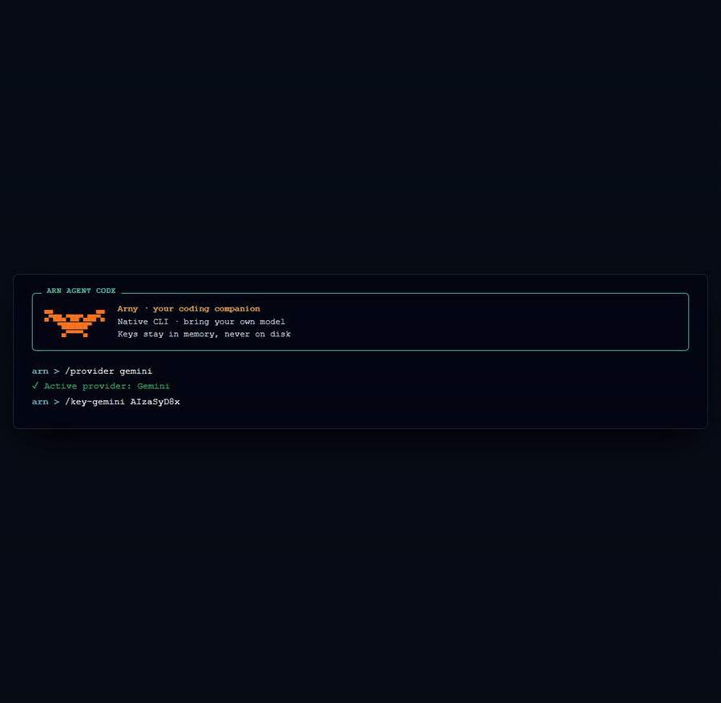

# ARN

**ARN is a lightweight native C++23 coding assistant for a project on your
machine.** It streams answers from Gemini or DeepSeek, can inspect and propose
file changes, and asks for confirmation before changing anything. The ARN CLI
itself has no Node.js or Python runtime dependency.

Use it when you want a small terminal-first assistant—or the included Windows
IDE—while keeping provider calls, model selection, and local file access under
your control.



## What ARN does today

- Runs as a native `arn` executable on Windows, Linux, and macOS release
  targets. Windows also has a portable Tauri 2 + React IDE.
- Connects to **Google Gemini** and **DeepSeek** using your own API key.
- Verifies provider access, discovers the models available to that key, and
  lets you choose a model with `/models` and `/model`.
- Streams responses, retries temporary API failures, and cancels an active
  request with `Esc` or `Ctrl+C`.
- Keeps the current conversation in memory only; keys and chat history are not
  written to ARN configuration files.
- Lets a model list and read project files, or request creates, edits, and
  deletions that require explicit approval.

The current provider/model work is **Phase 1** of
[AGENTS_ROADMAP.md](AGENTS_ROADMAP.md): `ApiClient` is a provider-neutral
facade, while each provider owns its API details, model discovery, streaming,
errors, cancellation, and session state. This is an internal architecture
improvement; it does not add agents, skills, subagents, or automatic model
routing.

## Install

### Download a release

The simplest option is the [latest release page](https://github.com/arnecto/arn/releases/latest).
Download the archive for your platform, extract it, and run `arn` (or
`arn.exe`). Keep the files from an archive together so the executable can find
its bundled OpenSSL libraries.

Available release archives are:

- **Windows x64 CLI:** `arn-windows-x64.zip`
- **Windows x64 IDE:** `arn-ide-windows-x64.zip` — extract it and start
  `arn-ide.exe`. It requires the [Microsoft Edge WebView2 Runtime](https://developer.microsoft.com/microsoft-edge/webview2/).
- **Linux x64 CLI:** `arn-linux-x64.tar.gz`
- **macOS Apple Silicon CLI:** `arn-macos-arm64.tar.gz`
- **macOS Intel CLI:** `arn-macos-x64.tar.gz`

The Windows IDE is currently distributed as a portable ZIP. A branded setup
installer is being prepared for a future tagged release.

### CLI install scripts

If you prefer a command-line installation, review the scripts and install the
latest CLI release:

```powershell
irm https://raw.githubusercontent.com/arnecto/arn/main/scripts/install.ps1 | iex
```

```bash
curl -fsSL https://raw.githubusercontent.com/arnecto/arn/main/scripts/install.sh | sh
```

The PowerShell script installs to `%LOCALAPPDATA%\Arn\bin` and adds it to the
current user's `PATH`. The shell script installs to `~/.local/bin` by default.
On macOS, install the OpenSSL runtime first:

```bash
brew install openssl@3
```

## First request

Open a terminal in the project you want ARN to work on and start it:

```text
arn
```

Then configure one provider for this session:

```text
/key-gemini YOUR_KEY
/models
/model gemini-...
Explain how this project is organized.
```

Use `/key-deepseek` for DeepSeek instead. `/help` lists all interactive
commands, including `/provider`, `/status`, `/clear-session`, and `/clear`.

API keys stay in process memory until ARN exits. Do not put keys in commands
you plan to share, commits, issue reports, or screenshots. Provider usage may
incur charges and is subject to the provider's quota and availability.

## Safe local tools

ARN treats the directory where it starts as the project root. A model may use
these tools:

- `list_files` and `read_file` inspect the project.
- `write_file` and `replace_text` show the proposed content or change and wait
  for a `y/N` confirmation.
- `delete_file` requires an explicit request and confirmation.

Paths are confined to the project root, including checks intended to prevent
escapes through `..` and links. ARN protects `.git`, environment and common
secret files, and limits reads to 256 KiB. It does not execute shell commands.
The IDE applies the same confirmation protocol and keeps unsaved editor buffers
from being overwritten by an approved agent operation.

## ARN IDE

The optional Windows desktop IDE uses Tauri 2, React, and Monaco for the user
interface. It does **not** reimplement provider or file-tool logic in Rust: it
starts the existing C++ executable with `arn --server` and exchanges JSONL
messages with it.

It includes a project file tree, multi-tab editor, provider verification and
model selection, streamed chat, cancellation, and a before/after review for
each requested file change. Read [the IDE guide](ide/README.md) and the
[bridge protocol guide](docs/ide-arn-bridge.md) for setup, limitations, and
test commands.

## Build from source

Building the CLI requires CMake 3.20+, a C++23 compiler, OpenSSL development
files, Git, and network access for CMake's fetched dependencies.

### Windows

```powershell
cmake -S . -B build
cmake --build build --config Release
.\build\Release\arn.exe
```

Ensure the OpenSSL runtime DLLs selected by your build are available beside
`arn.exe` or on `PATH`.

### Linux

```bash
sudo apt-get update
sudo apt-get install -y build-essential cmake ninja-build libssl-dev
cmake -S . -B build -G Ninja -DCMAKE_BUILD_TYPE=Release
cmake --build build --parallel
./build/arn
```

### macOS

```bash
brew install cmake ninja openssl@3
cmake -S . -B build -G Ninja -DCMAKE_BUILD_TYPE=Release \
  -DOPENSSL_ROOT_DIR="$(brew --prefix openssl@3)"
cmake --build build --parallel
./build/arn
```

macOS has release targets, but compatibility remains experimental. To develop
the IDE, see the extra Node.js and Rust/Tauri requirements in
[ide/README.md](ide/README.md); those are IDE build requirements, not CLI
runtime requirements.

## Architecture

```text
terminal UI / ARN IDE
          |
     ApiClient facade
          |
     ModelProvider interface
       |              |
  Gemini provider  DeepSeek provider
          |
     HTTPS + streaming API

     ToolExecutor -> confirmed, project-root-safe file operations
```

Provider-specific authentication, request formats, streaming parsing, model
discovery, errors, cancellation, and session history stay behind the provider
interface. The terminal UI, JSONL server, and IDE consume the common behavior.

## Current limits and roadmap

ARN is still an early project. It has no persistent configuration, shell
execution, integrated terminal, debugger, Git UI, offline model backend, or
guarantee that a provider accepts a particular key or model. Real provider
requests require your own valid credentials; local builds and tests do not
prove provider access.

[AGENTS_ROADMAP.md](AGENTS_ROADMAP.md) describes later work. Agents, skills,
automatic agent/model routing, and subagents are planned concepts and are not
current ARN features.

## Development and security

See [CONTRIBUTING.md](CONTRIBUTING.md) for the contribution workflow,
[SECURITY.md](SECURITY.md) for vulnerability reporting, and
[docs/releases/v0.5.0.md](docs/releases/v0.5.0.md) for the v0.5.0 release
notes. The project is released under the [MIT License](LICENSE).
