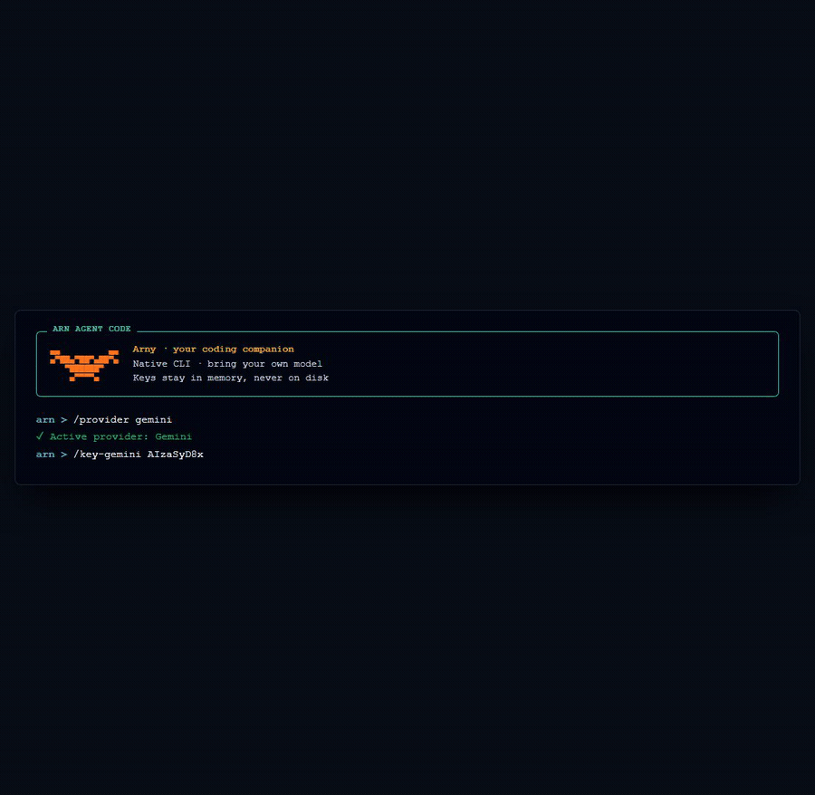

# ARN Code

**ARN Code is a lightweight native C++23 coding assistant for projects on your
machine.** It streams answers from Gemini, DeepSeek, or OpenRouter, can inspect
and propose file changes, and asks for confirmation before changing anything.
The ARN Code CLI has no Node.js or Python runtime dependency.

Use it when you want a small terminal-first assistant—or the included Windows
IDE—while keeping provider calls, model selection, and local file access under
your control.

ARN is the broader ecosystem. ARN Code is built on
[ARN Core](https://github.com/ARN-Forge/arn-core), the reusable native C++23 AI
agent framework shared by ARN applications.



## What ARN Code does today

- Runs as a native `arn` executable on Windows, Linux, and macOS release
  targets. Windows also has a portable Tauri 2 + React IDE.
- Connects to **Google Gemini**, **DeepSeek**, and **OpenRouter** using your own
  API key.
- Verifies provider access, discovers the models available to that key, and
  lets you choose a model with `/models` and `/model`.
- Streams responses, retries temporary API failures, and cancels an active
  request with `Esc` or `Ctrl+C`.
- Keeps the current conversation in memory only; keys and chat history are not
  persisted to disk by ARN Code.
- Lets a model list and read project files, or request creates, edits, and
  deletions that require explicit approval.
- Provides Explorer, Planner, Coder, and Reviewer workflows through `/agent`,
  with the same provider, sandbox, and confirmation boundaries as normal chat.

The current provider/model work is **Phase 1** of
[AGENTS_ROADMAP.md](AGENTS_ROADMAP.md): `ApiClient` is a provider-neutral
facade, while ARN Core provides the common provider interface and reusable
provider implementations. Provider-specific API details, model discovery,
streaming, errors, cancellation, and session state remain behind that boundary.

## Install

### Windows

Run this in **PowerShell**, not Command Prompt (`cmd.exe`):

```powershell
irm https://raw.githubusercontent.com/ARN-Forge/ARN-Code/main/scripts/install.ps1 | iex
arn
```

The installer uses `%LOCALAPPDATA%\Arn\bin`, adds it to your user `PATH`, and
verifies the installed executable. Open a new terminal if `arn` is not yet
visible in another terminal window.

### Linux and macOS

```bash
curl -fsSL https://raw.githubusercontent.com/ARN-Forge/ARN-Code/main/scripts/install.sh | sh
arn
```

The script installs to `~/.local/bin`, adds that directory to your shell
profile when needed, and verifies the executable. On macOS, install the
OpenSSL runtime first with `brew install openssl@3`.

### Manual download

Download an archive from the [latest release page](https://github.com/ARN-Forge/ARN-Code/releases/latest),
extract it, and keep its files together so the executable can find its bundled
runtime libraries.

Available release archives are:

- **Windows x64 CLI:** `arn-windows-x64.zip`
- **Windows x64 IDE:** `arn-ide-windows-x64.zip` — extract it and start
  `arn-ide.exe`. It requires the [Microsoft Edge WebView2 Runtime](https://developer.microsoft.com/microsoft-edge/webview2/).
- **Windows x64 IDE installer:** `arn-ide-windows-x64-setup.exe`
- **Linux x64 CLI:** `arn-linux-x64.tar.gz`
- **macOS Apple Silicon CLI:** `arn-macos-arm64.tar.gz`
- **macOS Intel CLI:** `arn-macos-x64.tar.gz`

## First request

Open a terminal in the project you want ARN Code to work on and start the CLI:

```text
arn
```

Then configure one provider for this session:

```text
/key-gemini
/models
/model gemini-...
Explain how this project is organized.
```

Use `/key-deepseek` for DeepSeek or `/key-openrouter` for OpenRouter instead.
ARN then opens a masked prompt; the key is never echoed and remains in memory only.
`/help` lists all interactive commands, including `/provider`, `/status`,
`/clear-session`, and `/clear`.

Provider and agent commands:

- `/provider <gemini|deepseek|openrouter>` changes the active provider.
- `/models` lists models returned for the verified account.
- `/model <name>` selects one of those models.
- `/agent <task>` runs Explorer → Planner, asks whether to continue, then runs
  Coder → Reviewer.
- `/agent --auto <task>` runs the same workflow without the plan checkpoint;
  every requested file change still needs confirmation.
- `/agent explorer <task>`, `/agent planner <task>`, `/agent coder <task>`, and
  `/agent reviewer <task>` run one profile directly.

API keys stay in process memory until ARN Code exits. Inline key arguments are
disabled, so enter keys only through the masked prompt. Never put keys in commits,
issue reports, or screenshots. Provider usage may
incur charges and is subject to the provider's quota and availability.

## Safe local tools

ARN Code treats the directory where it starts as the project root. A model may
use these tools:

- `list_files` and `read_file` inspect the project.
- `write_file` and `replace_text` show the proposed content or change and wait
  for a `y/N` confirmation.
- `delete_file` requires an explicit request and confirmation.

Paths are confined to the project root, including checks intended to prevent
escapes through `..` and links. ARN Code protects `.git`, environment and common
secret files, and limits reads to 256 KiB. It does not execute shell commands.
The IDE applies the same confirmation protocol and keeps unsaved editor buffers
from being overwritten by an approved agent operation.

## ARN Code IDE

The optional Windows desktop IDE for ARN Code uses Tauri 2, React, and Monaco
for the user interface. It does **not** reimplement provider or file-tool logic
in Rust: it starts the existing C++ executable with `arn --server` and exchanges
JSONL messages with it.

It includes a project file tree, multi-tab editor, provider verification and
model selection, streamed chat, cancellation, and a before/after review for
each requested file change. Read [the IDE guide](ide/README.md) and the
[bridge protocol guide](docs/ide-arn-bridge.md) for setup, limitations, and
test commands.

## Build from source

Building the CLI requires CMake 3.20+, a C++23 compiler, OpenSSL development
files, Git, and network access for CMake's fetched dependencies.

Clone the canonical repository first:

```bash
git clone https://github.com/ARN-Forge/ARN-Code.git
cd ARN-Code
```

### Windows

```powershell
cmake -S . -B build
cmake --build build --config Release
.\build\Release\arn.exe
```

Ensure the OpenSSL runtime DLLs selected by your build are available beside
`arn.exe` or on `PATH`.

### Linux

```bash
sudo apt-get update
sudo apt-get install -y build-essential cmake ninja-build libssl-dev
cmake -S . -B build -G Ninja -DCMAKE_BUILD_TYPE=Release
cmake --build build --parallel
./build/arn
```

### macOS

```bash
brew install cmake ninja openssl@3
cmake -S . -B build -G Ninja -DCMAKE_BUILD_TYPE=Release \
  -DOPENSSL_ROOT_DIR="$(brew --prefix openssl@3)"
cmake --build build --parallel
./build/arn
```

macOS has release targets, but compatibility remains experimental. To develop
the IDE, see the extra Node.js and Rust/Tauri requirements in
[ide/README.md](ide/README.md); those are IDE build requirements, not CLI
runtime requirements.

## Architecture

```text
ARN Code terminal UI / desktop IDE
          |
     ApiClient facade
          |
     ARN Core ModelProvider interface
       |              |               |
  Gemini provider  DeepSeek provider  OpenRouter provider
          |
     HTTPS + streaming API

     ToolExecutor -> confirmed, project-root-safe file operations
```

Provider-specific authentication, request formats, streaming parsing, model
discovery, errors, cancellation, and session history stay behind ARN Core's
provider interface. The ARN Code terminal UI, JSONL server, and IDE consume the
common behavior.

## Current limits and roadmap

ARN Code is still an early project. It has no persistent configuration, shell
execution, integrated terminal, debugger, Git UI, offline model backend, or
guarantee that a provider accepts a particular key or model. Real provider
requests require your own valid credentials; local builds and tests do not
prove provider access.

[AGENTS_ROADMAP.md](AGENTS_ROADMAP.md) describes later work. The initial
Explorer, Planner, Coder, and Reviewer profiles are available. Skills,
automatic model routing, and isolated subagents remain planned concepts.

## Development and security

See [CONTRIBUTING.md](CONTRIBUTING.md) for the contribution workflow,
[SECURITY.md](SECURITY.md) for vulnerability reporting, and
[docs/releases/v0.5.0.md](docs/releases/v0.5.0.md) for the v0.5.0 release
notes. The project is released under the [MIT License](LICENSE).
